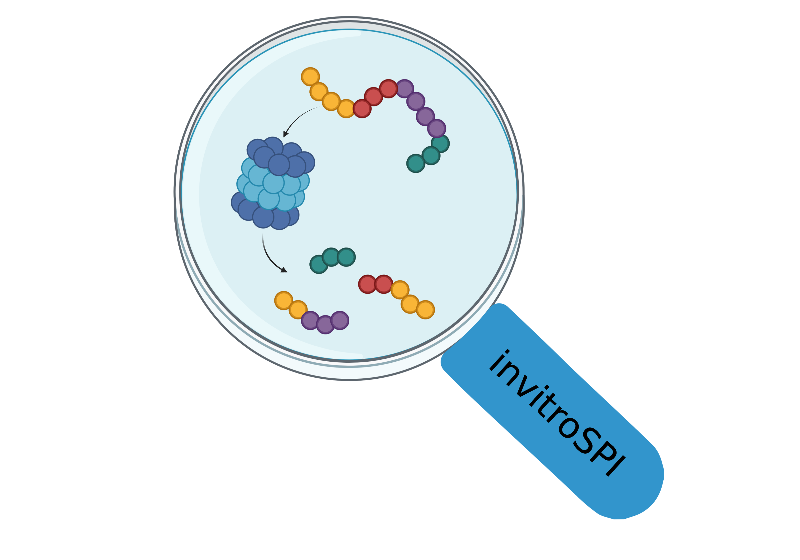

# invitroSPI
Spliced peptide identification from in vitro digestions of polypeptides with purified proteasomes

## overview
The invitroSPI pipeline consists of four main steps that are implemented in a [Snakemake](https://snakemake.readthedocs.io/en/stable/) workflow:
1. parsing of search result files and creation of a preliminary MS database (*MSDB*) containing all peptide-spectrum matches (PSMs)
2. scoring and filtering of PSMs using Mascot's ion score and q-value as well as the delta score described in the manuscript
3. identification and, optionally, removal of synthesis errors using the control runs
4. mapping of peptides to the substrate sequence accounting for potential multi-mappers
5. simple database statistics

Additionally, code for the computation of all possible spliced and non-spliced peptides which is used for the Mascot search is provided in `SOURCE/computeAllPossible.R`. We also include a script containing useful functions for downstream analyses (`invitroSPI_utils.R`).

## execution
invitroSPI relies on [Conda](https://docs.conda.io/en/latest/) and Snakemake.
In order to install Conda, click on this [link](https://docs.conda.io/en/latest/miniconda.html) and follow the installation guidelines for your respective operating system.  
After installing Conda, you need to install Snakemake. The Snakemake installation procedure is described [here](https://snakemake.readthedocs.io/en/stable/getting_started/installation.html).

Briefly, open the terminal on your computer and paste the following lines sequentially:  
`conda install -n base -c conda-forge mamba`  
`conda activate base`  
`mamba create -c conda-forge -c bioconda -n snakemake snakemake`  
Additionally, you might need to run `conda update conda`.

Download this repository as a .zip file (click on *Code* at the upper right corner of this repository --> Download ZIP), move the .zip file in the desired directory on your computer and unpack it.
Open the terminal in this directory and enter: `conda activate snakemake`.

The pipeline can be executed by pasting `snakemake --use-conda --cores all -R createMSDB` into the terminal. The progress of the pipeline execution should appear in your terminal window.
Note that upon reexecution, Snakemake will delete all previously generated output files. We therefore recommend, to rename the final *ProteasomeDB* or move it into another directory.

After your jobs finished, enter `conda deactivate` in order to terminate your Conda environment.

## input
invitroSPI identifies spliced and non-spliced peptides from Mascot search result files. Therefore, the user must provide a table `sample_list.csv` in the `INPUT/` folder containing information about:
- project name
- substrate ID
- substrate sequence
- time point
- search result file name
- replicate
- MSfile (optional)

Additionally, the user must provide **search result** files deposited in the folder `INPUT/search_results/` and list their names in the `sample_list.csv` table.

An example of the `sample_list.csv` table is given below and can be modified accordingly by the user:

| project_name | substrateID | substrateSeq | digestTime | filename | replicate | MSfile |
| ----- | ----- | ----- | ----- | ----- | ----- | ----- |
| test_data | TSN2 | TSN2.fasta | 4 | F029125.csv | 1 | |
| test_data | TSN89 |	RTKAWNRQLYPEW	| 4	| F029129.csv |	1 | |
| test_data | TSN2 | VSRQLRTKAWNRQLYPEWTEAQR |	CTRL |	F029123.csv |	1 | |
| test_data | TSN89 |	RTKAWNRQLYPEW |	CTRL |	F029127.csv |	1 | |

You can either paste the substrate sequence in the `sample_list` directly or put the name of a single-entry .fasta file containing the substrate sequence. This file should be located in `INPUT/sequences`.

Note that also the filenames of the control files must be provided. For the control files, put `CTRL` in the `digestTime` column.  
`MSfile` is an optional column that might be helpful to keep track of the .raw/.mgf files that were used to generate the respective search result files.

The invitroSPI workflow is constructed in such a way that the user can keep appending projects and search result files to the `sample_list`. However, only the samples of the current project (which is specified in `INPUT/config.yaml`) are processed and stored separately in `OUTPUT/project_name` subdirectories.

## output
The pipeline provides a final database of identified spliced and non-spliced peptides in .csv format (`OUTPUT/project_name/ProteasomeDB.csv`) as well as all intermediate files in binary format (`OUTPUT/project_name/tmp/`).

## parameters that can be modified by the user
We are using the following default parameters that are specified in the `INPUT/config.yaml` file and that can be changed by the user:
- `project_name`: indicates which files listed in the `sample_list.csv` should be processed (enter valid directory names only! - no spaces or umlauts)
- `delta_score`: 0.3
- `ion_score`: 20
- `q_value`: 0.05
- `keep_synErrors`: "no"

In case you would like to include synthesis errors (labelled as such) in the final *ProteasomeDB*, change the `keep_synErrors` flag accordingly.
